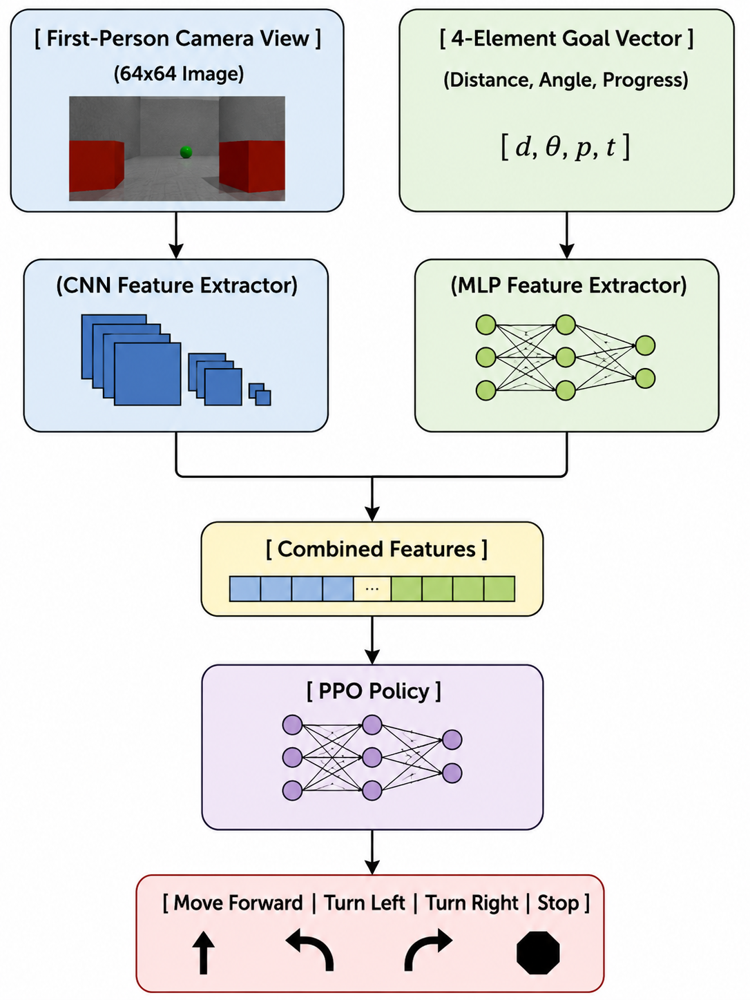
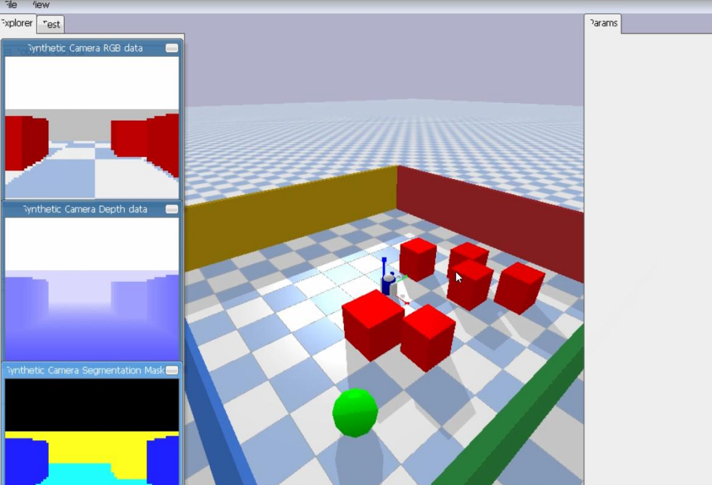
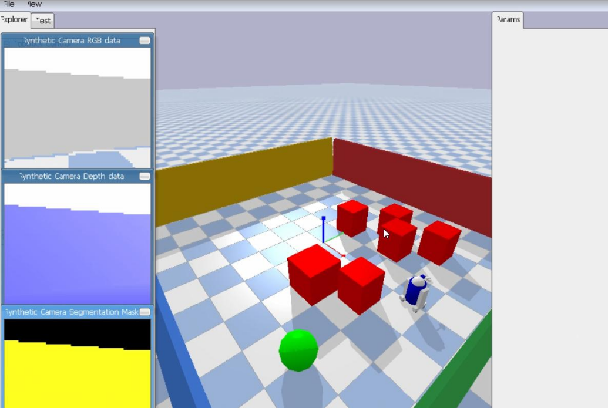
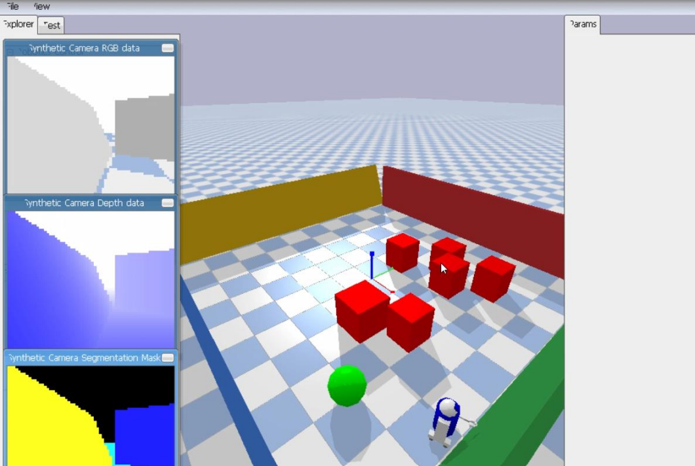
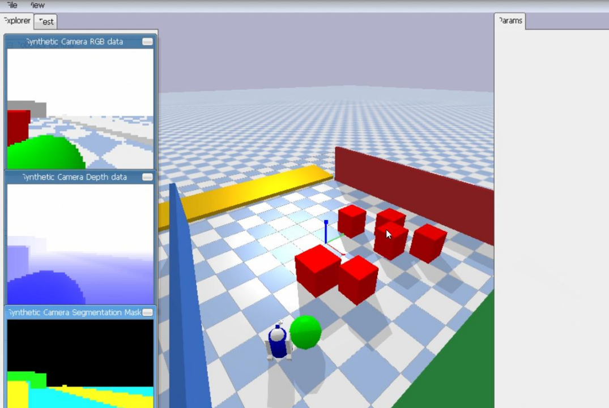
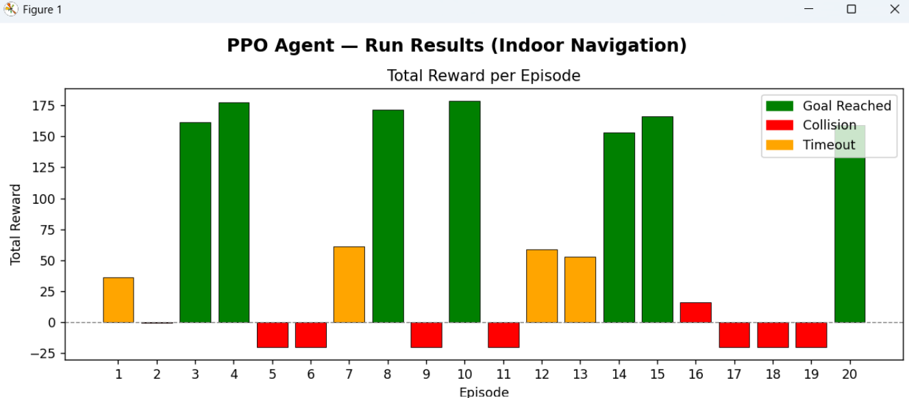

# 🤖 Vision-Based Indoor Navigation (PPO + CNN)

A Deep Reinforcement Learning project where a virtual robot learns to navigate an indoor room, avoid obstacles, and reach a target green sphere using only a camera view and directional cues—no maps, GPS, or pre-programmed routes.


---

## 📌 Problem Statement

Autonomous indoor navigation is challenging because robots cannot rely on GPS indoors. They must use sensor information, such as cameras, to understand their surroundings and reach a target.

This project focuses on mapless visual navigation, where:
* 🤖 **The robot moves inside a 3D simulated environment** with random obstacles.
* 📷 **It uses a 64×64 RGB camera** to see its surroundings[cite: 1].
* 🟢 **A green goal** is randomly placed in the environment[cite: 1].
* 🟥 **Red obstacles** are placed between the robot and the goal[cite: 1].
* 🗺️ **No map, GPS, or pre-defined path** is provided[cite: 1].
* 🧠 **The robot learns how to reach the goal and avoid obstacles** through Deep Reinforcement Learning[cite: 1].

---

## 🎯 Project Objectives

The goal is to train a PPO-based Deep Reinforcement Learning agent that can[cite: 1]:
* 📷 **Understand its surroundings** using RGB camera images[cite: 1].
* 🧭 **Use the goal direction and distance** to guide navigation[cite: 1].
* 🎮 **Choose between four actions:** Forward, Left, Right, and Stop[cite: 1].
* 🛑 **Avoid collisions** with obstacles[cite: 1].
* 🟢 **Reach the target** efficiently[cite: 1].
* 🔄 **Navigate successfully** across randomly generated environments without a pre-defined path[cite: 1].

---

## 🎬 How It Works
 
1. **Vision:** A small $64 \times 64$ RGB image from the robot's front camera.
2. **Goal Guidance (4 Values):** 
   - How far the goal is (normalized distance).
   - $\cos(\theta)$ and $\sin(\theta)$ representing the angle to the goal.
   - Current step count (time remaining in the episode).
3. **Brain (MultiInputPolicy):** A CNN looks at the image, an MLP reads the goal numbers, and PPO decides the next movement.

---

## 📸 Navigation in Action

Here is a typical run of the trained robot during a test episode:

| 1. Start Position `(0, 0)` | 2. Dodging an Obstacle |
|:---:|:---:|
|  |  |
| *Robot spawns in the room* | *Sees a red box ahead and turns away* |

| 3. Heading Toward Goal | 4. Goal Reached (+100 Reward) |
|:---:|:---:|
|  |  |
| *Lines itself up with the target* | *Hits the green sphere target successfully* |

---

## 🏆 Reward System (How It Learns)

The robot gets feedback after every single step:
- **Getting Closer:** Earns positive reward proportional to distance covered.
- **Facing the Goal:** Small bonus for looking toward the target (prevents spinning in circles).
- **Taking Time:** Small penalty (-0.05) every step to encourage finding the fastest path.
- **Hitting an Obstacle:** Huge penalty (-20.0) and the episode ends immediately.
- **Reaching the Goal:** Huge reward (+100.0) for finishing the task.

---

## 📈 Training Performance

| Average Reward Per Episode | Average Steps Per Episode |
|:---:|:---:|
|  |  |
| *Rewards rise steadily as navigation improves* | *Steps decrease as the agent finds shorter paths* |

- **First 200k steps:** Robot bumps into boxes frequently while exploring.
- **200k - 600k steps:** Learns to face the goal and avoid straight-on crashes.
- **600k+ steps:** Successfully weaves around obstacles in newly generated room layouts.

---

## 📁 Project Structure

```plaintext
.
├── envs/
│   └── indoor_nav_env.py        # PyBullet room environment, physics, and rewards
├── training/
│   ├── train_agent.py           # Training script with PPO hyperparameters
│   └── run_agent.py             # Script to watch the trained robot live in 3D
├── models/
│   ├── ppo_cnn_indoor_nav.zip   # Final trained model
│   └── checkpoints/             # Checkpoints saved every 100k steps
├── logs/
│   └── tensorboard/             # Training logs
├── screenshots/                 # Images for this README
├── plot_training.py             # Script to generate reward and step plots
├── requirements.txt             # Project dependencies
└── README.md                    # Documentation
